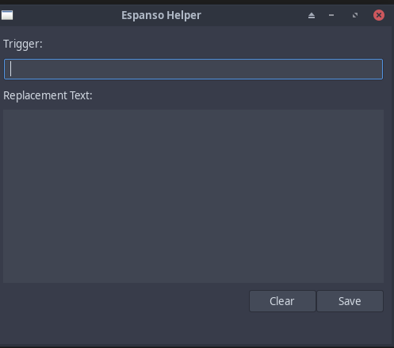

# Espanso Helper GUI

A simple, lightweight GTK3-based GUI tool for managing [Espanso](https://espanso.org/) text expansions. Written in pure C, this application provides a user-friendly interface for adding new text expansions to your Espanso configuration.



## Features

- 🖥️ Clean, native GTK3 interface
- ✍️ Multi-line text expansion support
- 🔄 Direct YAML configuration file manipulation
- ⚡ Fast and lightweight
- 🐧 Linux/Unix compatible
- 🔒 Safe file handling with proper error checking

## Prerequisites

- GTK3 development libraries
- GCC compiler
- make
- pkg-config

### On Arch Linux
```bash
sudo pacman -S gtk3 base-devel
```

### On Ubuntu/Debian
```bash
sudo apt install libgtk-3-dev build-essential
```

### On Fedora
```bash
sudo dnf install gtk3-devel gcc make
```

## Building

1. Clone the repository:
```bash
git clone https://github.com/yourusername/espanso-helper.git
cd espanso-helper
```

2. Build the application:
```bash
make
```

## Installation

After building, you can install the application to your local bin directory:

```bash
mkdir -p ~/.local/bin
cp espanso_helper ~/.local/bin/
```

Make sure `~/.local/bin` is in your PATH.

## Usage

1. Start the application:
```bash
espanso_helper
```

2. In the application:
   - Enter your trigger text (e.g., ":email")
   - Type or paste your replacement text in the large text area
   - Click "Save" to add the expansion
   - Use "Clear" to reset both fields

The tool will automatically:
- Create the Espanso configuration directory if it doesn't exist
- Initialize the YAML file with proper formatting
- Safely append new expansions to your configuration

## Configuration

The tool works with Espanso's standard configuration structure:
- Default configuration path: `~/.config/espanso/match/`
- Uses `c_yaml.yml` for storing expansions
- Maintains proper YAML formatting with `matches:` header

## Contributing

Contributions are welcome! Feel free to:
- Report bugs
- Suggest features
- Submit pull requests

## License

This project is licensed under the MIT License - see the LICENSE file for details.

## Acknowledgments

- [Espanso](https://espanso.org/) - The fantastic text expander that inspired this tool
- [GTK Project](https://www.gtk.org/) - For the excellent GUI toolkit

## Author

[Alexander Graf] - Initial work

## Support  

If you encounter any issues or have questions, please file an issue on the GitHub repository.
